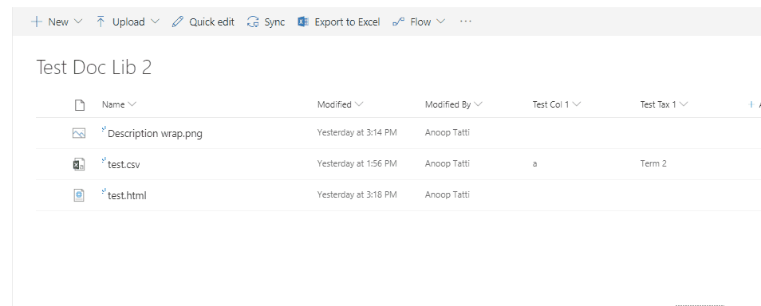

# SPFx Copy Classic Link Extension

## Summary
Sample SharePoint Framework list view command set extension that copies the classic link (path) of a selected item. Uses copy-to-clipboard library, toastr and sweet alert for notifications.




## Used SharePoint Framework Version 


## Applies to

* [SharePoint Framework Extensions](https://dev.office.com/sharepoint/docs/spfx/extensions/overview-extensions)

## Solution

Solution|Author(s)
--------|---------
js-command-copy-classic-link | Anoop T ([@anooptells](https://twitter.com/anooptells))

## Version history

Version|Date|Comments
-------|----|--------
1.0|October 11, 2018|Initial release

## Disclaimer
**THIS CODE IS PROVIDED *AS IS* WITHOUT WARRANTY OF ANY KIND, EITHER EXPRESS OR IMPLIED, INCLUDING ANY IMPLIED WARRANTIES OF FITNESS FOR A PARTICULAR PURPOSE, MERCHANTABILITY, OR NON-INFRINGEMENT.**

---

## Minimal Path to Awesome

- Clone this repository
- Update the `pageUrl` properties in the **config/serve.json** file
  - The `pageUrl` should be a modern page
  - This property is only used during development in conjunction with the `gulp serve` command
- In the command line navigate to the js-command-copy-classic-link folder and run:
  - `npm install`
  - `gulp serve --config=copyClassicLinkToastr` or `gulp serve --config=copyClassicLinkSwal`

## Features

This extension illustrates the following concepts:

- Using **copy-to-clipboard** for building copying the link.
- Using **SweetAlert** and **toastr** for displaying alerts.
- Using **Code splitting** to load packages only when needed. [Code Splitting in SharePoint Framework (SPFx)](https://www.vrdmn.com/2018/10/code-splitting-in-sharepoint-framework.html)  

## Debug URL for testing
Here's a debug querystring for testing this sample:

```
?loadSPFX=true&debugManifestsFile=https://localhost:4321/temp/manifests.js&customActions={"57ecbfd1-fb14-4bc8-b4d6-fa2701ba532f":{"location":"ClientSideExtension.ApplicationCustomizer","properties":{"showToastr":"no"}}}
```

Your URL will look similar to the following (replace with your domain and site address):
```
https://yourtenant.sharepoint.com/sites/yoursite?loadSPFX=true&debugManifestsFile=https://localhost:4321/temp/manifests.js&customActions={"57ecbfd1-fb14-4bc8-b4d6-fa2701ba532f":{"location":"ClientSideExtension.ApplicationCustomizer","properties":{"showToastr":"no"}}}
```
